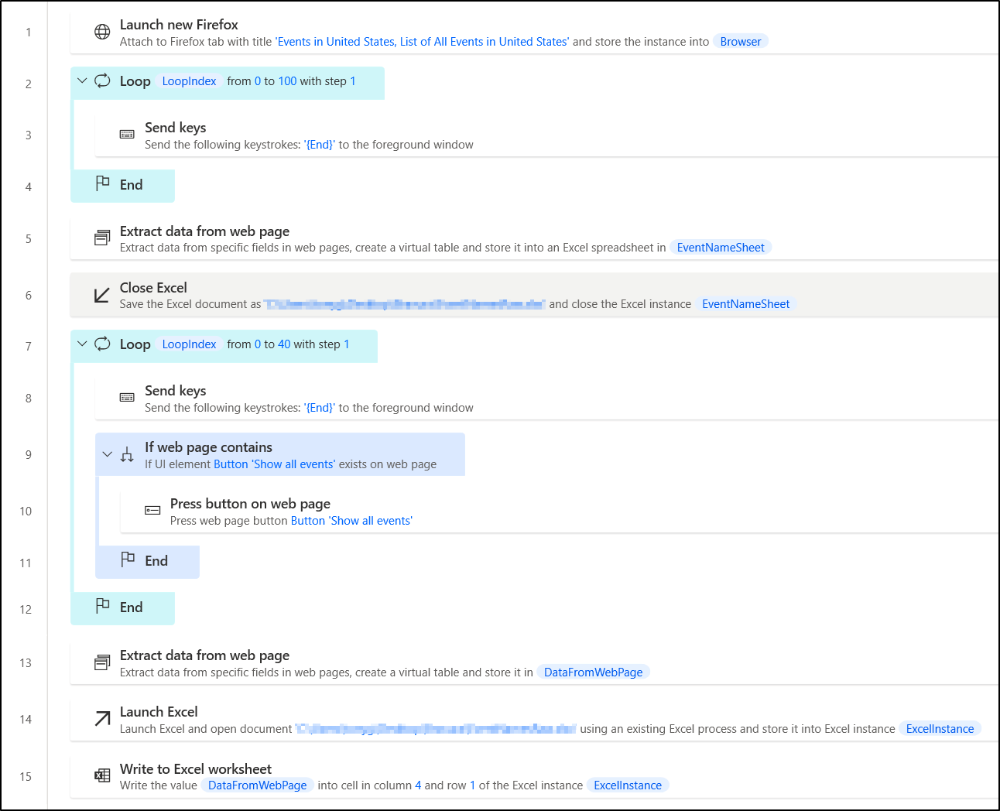
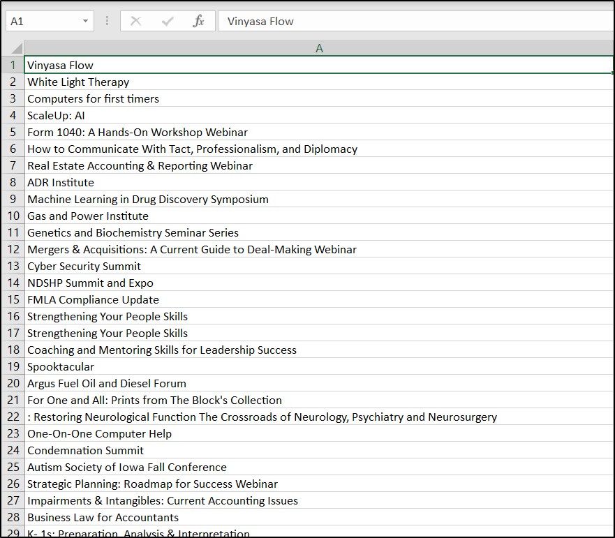
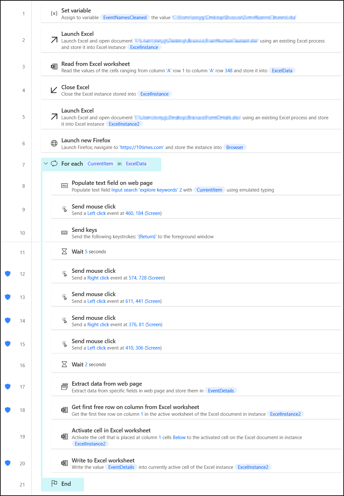
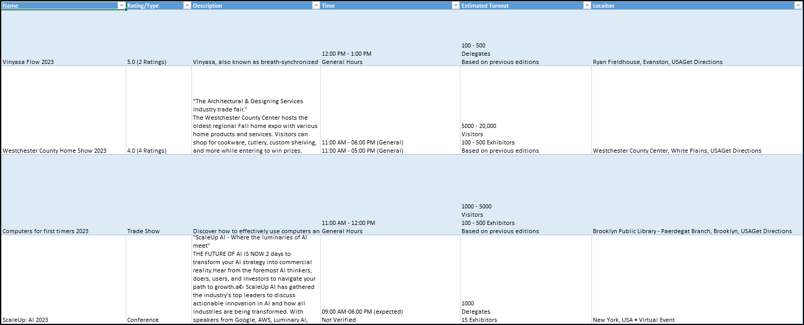

# Scraping-Project-1

What follows is an account of attempting to scrape two separate websites during the execution of a single project. The initial focus was on scraping LinkedIn data surrounding event attendees, and focus was then shifted to scraping 10Times for details surrounding events. All actions described below or performed within were done so for research purposes only. Any data collected is publicly accessible and all techniques that were used followed proper and legitimate authentication protocols.

## Table of Contents

- [Chapter 1: Getting Ideas LinkedIn To Place](https://github.com/Gigert9/Scraping-Project-1/tree/main#chapter-1-getting-ideas-linkedin-to-place)
    - [Snaking Our Way Towards Progress](https://github.com/Gigert9/Scraping-Project-1/tree/main#snaking-our-way-towards-progress)
    - [LSv1.py](https://github.com/Gigert9/Scraping-Project-1/tree/main#lsv1py)
- [Chapter 2: Things Get 10Times Different](https://github.com/Gigert9/Scraping-Project-1/tree/main#chapter-2-things-get-10times-different)
    - [Main.py](https://github.com/Gigert9/Scraping-Project-1/tree/main#mainpy)
    - [Adding More Power](https://github.com/Gigert9/Scraping-Project-1/tree/main#adding-more-power)
- [Chapter3: Scraping Up The Pieces](https://github.com/Gigert9/Scraping-Project-1/tree/main/README.md#chapter-3-scraping-up-the-pieces)
    - [Moving Foward](https://github.com/Gigert9/Scraping-Project-1/tree/main#moving-forward)

## Chapter 1: Getting Ideas LinkedIn To Place

This project has gone through many iterations. In the earliest stages, the projects inception was directly linked to the timing of real-world events. I was originally commissioned to create a script that would scrape contact information from [LinkedIn](https://www.linkedin.com) profiles that supplied them, if the user was registered to attend a given event. The requirements called for the extraction of various data elements, such as identification of companies related to past and current employment, job titles, profile bios, and of course the individual's contact information. Simple at a glance, but naturally (being a commissioned project) the state of the input data was limiting, and my plans erroneous. The expectation was to fully research, validate, and compile the required data given nothing more than a list of names. 

My immediate (perhaps foolish) reaction was to create a BASH script that would make use of **curl** requests. I figured it would be as easy as then using **grep** to parse the returned HTML code of the page for the specific values given for the various elements. Rinse and repeat per query, right? Heck you could even feed the script with a file of names to read, and it could then parse each name and use **curl** to request the page featuring the given search parameters before scraping for specific web elements. After cleaning the returned data and parsing for the specific values with **grep**, it should be possible to simply compare the returned values with the expected known values and determine which returned profile matched each given individual. Finally, the script could again make use of a **curl** request to the specific profile page and parse out the contact information. This is an embarrassingly amateur approach, and one that is far from effecient. While it may be possible to create the script described, in order to ensure a final deliverable that would fulfill the Project Lead's requests and big picture end goals (as well as the length and logical complexity needed), BASH is hardly the best option.

### Snaking Our Way Towards Progress

After returning to a more rational thought process, I attempted utilizing Python for a solution. While pursuing previous studies I had seen the capabilities of the language in the realm of web-based interactions, and it seemed like a perfect fit. I begin by reading various online sources, and eventually made my way to [GitHub](https://www.github.com) and located several handy repositories. The most helpful, beyond a shadow of a doubt, was [linkedin_scraper]( https://github.com/joeyism/linkedin_scraper) by “joeyjism”. I’m eternally grateful for the assistance provided in the form of succinct README files and flawless code. It was very easy to understand their tool, and furthermore it functioned properly with little error. Sadly, it lacked the ability to scrape a crucial desired piece of data. 

Still, by reverse engineering the tool and writing my own script to call its libraries, I was able to make great progress. Both while initially considering BASH, and when initially approaching a Python environment, the action of logging in proved to be the first initial hurdle. LinkedIn does not permit users to visit the fully profile page of another user without first authenticating to the platform. However, once I implemented the libraries and tools provided by [joeyjism]( https://github.com/joeyism), this issue was immediately solved by passing along legitimate login credentials for an existing account.

As mentioned, the scraper tool was not natively designed to deliver a particular requested data element and was therefore not enough to satisfy the requirements of the project on its own. Additionally, the tool required specific profile URLs to be provided, which would then be scraped for data. While it was easy write the code needed to interperet a file listing profile URLs, we had no way of knowing the specific profile URLs. We only had the names.

Once again I searched through many GitHub repositories, and found a potential answer in the next major tool I located. The [linkedin-scrapper](https://github.com/info3g/linkedin-scrapper) by "info3g" included the ability to search through LinkedIn and parse results by page. This was incredibly handy, as it solved the issue of locating profile URLs. Or at least, might have offered a way to locate the correct profiles associated with each given name. For an added bonus, the code provided seemed to attempt to scrape the missing data point we needed!

Sadly, LinkedIn is not very friendly about sharing their users' data. Despite this data being willfully uploaded by said users to a site that allows anyone with a profile to view others' profiles. Naturally, I made use of a few sock puppet accounts when running my script, but it was to no avail. One account was even flagged, and required physical ID to verify, after a mere 24 hours without even making use of any scraping techniques. Furthermore the real-world events that related to the initial proposition for this project had begun and the project itself now seemed uneccessary, if not at least no longer a priority.

### LSv1.py

This is final iteration of my LinkedIn web scraper. Written in Python, and making use of various additional libraries, I am leaving this here for anyone attempting a similar project in the hopes that my links and description might help in some way. 

Given the development process described above, the script is broken into a few sections. After importing the various required Python libraries, we begin by assigning our browser to a driver variable and logging into LinkedIn. The next step is to perform a search given a name read from a local file and then the scraping can begin. All of the code for reading the Profile Details, Contact Info, and exporting that data to a .xlsx file is performed by the tool provided by [info3g](https://github.com/info3g). The bottom portion of the script has been commented out and features the first portions of code developed using the first scraping tool I discovered. As noted, this section will not supply the email address regardless of the presence of one in a given profile's contact information section.

Still, it was very exciting getting this script to perform as successfully as it did before being blocked by LinkedIn's laser-focused security infrastructure. C'est la vie.

```
from linkedin_scraper import Person, actions
from selenium import webdriver
import time
from bs4 import BeautifulSoup
import xlsxwriter
from tkinter import *

driver = webdriver.Chrome()

#Logging in
email = "********************"
password = "********************"
actions.login(driver, email, password)

class Linkedin():
    f = open("names.txt", "r")
    for candidate in f:

        #*********** Search Result ***************#
        search_key = candidate # Enter your Search key here to find people
        key = search_key.split()
        keyword = ""
        for key1 in key:
            keyword = keyword + str(key1).capitalize() +"%20"
        keyword = keyword.rstrip("%20")
            
        global data
        data = []

        for no in range(1,2):
            start = "&page={}".format(no) 
            search_url = "https://www.linkedin.com/search/results/people/?keywords={}&origin=SUGGESTION{}".format(keyword,start)
            driver.get(search_url)
            #driver.maximize_window()
            for scroll in range(2):
                driver.execute_script("window.scrollTo(0, document.body.scrollHeight);")
                time.sleep(2)
            search = BeautifulSoup(driver.page_source,'lxml')
            peoples = search.findAll('a', attrs = {'data-control-name':'search_srp_result'})
            count = 0
            print("Going to scrape Page {} data".format(no))
            
            for people in peoples:
                count+=1

                if count%2==0:
                    
                    
                    
                    profile_url = "https://www.linkedin.com" + str(people['href'])
                    driver.get(profile_url)

                    # #********** Profile Details **************#
                    loc = ""
                    page = BeautifulSoup(driver.page_source,'lxml')
                    try:
                        cover = page.find('img', attrs = {'class':'profile-background-image__image relative full-width full-height'})['src']
                    except:
                        cover = 'None'

                    try:
                        profile = page.find("img", attrs = {
                            'class':'lazy-image pv-top-card-section__photo presence-entity__image EntityPhoto-circle-9 loaded'})['src']
                        
                    except:
                        profile = "None"

                    try:
                        title = str(page.find("li", attrs = {'class':'inline t-24 t-black t-normal break-words'}).text).strip()
                    except:
                        title = 'None'
                    try:
                        heading = str(page.find('h2', attrs = {'class':'mt1 t-18 t-black t-normal'}).text).strip()
                    except:
                        heading = 'None'
                    try:
                        loc = str(page.find('li', attrs = {'class':'t-16 t-black t-normal inline-block'}).text).strip()
                    except:
                        heading = 'None'


                    #*******  Contact Information **********#
                    time.sleep(2)
                    driver.get(profile_url + 'overlay/contact-info/')

                    info = BeautifulSoup(driver.page_source, 'lxml')
                    details = info.findAll('section',attrs = {'class':'pv-contact-info__contact-type'})
                    try:
                        websites = details[1].findAll('a')
                        for website in websites:
                            website = website['href']
                            
                    except:
                        website = 'None'
                    try:
                        phone = details[2].find('span').text
                    except:
                        phone = 'None'
                    try:
                        email = str(details[3].find('a').text).strip()
                    except:
                        email = 'None'
                    try:
                        connected = str(details[-1].find('span').text).strip()
                    except:
                        connected = 'None'

                    
                    data.append({'profile_url':profile_url,'cover':cover,'profile':profile,'title':title,'heading':heading,'loc':loc,'website':website,'phone':phone,'email':email,'connected':connected,})
            print("!!!!!! Data scrapped !!!!!!")
                
        #driver.quit()

        #Export Profile Data from Search Results to .xlsx file
        def writeData(self):
            workbook = xlsxwriter.Workbook("profiles.xlsx")
            worksheet = workbook.add_worksheet('Peoples')
            bold = workbook.add_format({'bold': True})
            worksheet.write(0,0,'profile_url',bold)
            worksheet.write(0,1,'Name',bold)
            worksheet.write(0,2,'cover',bold)
            worksheet.write(0,3,'profile image',bold)
            worksheet.write(0,4,'heading',bold)
            worksheet.write(0,5,'location',bold)
            worksheet.write(0,6,'website',bold)
            worksheet.write(0,7,'phone',bold)
            worksheet.write(0,8,'email',bold)
            worksheet.write(0,9,'connected',bold)
            for i in range(1,len(data)+1):
                
                try:
                    worksheet.write(i,0,data[i]['profile_url'])
                except:
                    pass
                try:
                    worksheet.write(i,1,data[i]['title'])
                except:
                    pass
                try:
                    worksheet.write(i,2,data[i]['cover'])
                except:
                    pass
                try:
                    worksheet.write(i,3,data[i]['profile'])
                except:
                    pass
                try:
                    worksheet.write(i,4,data[i]['heading'])
                except:
                    pass
                try:
                    worksheet.write(i,5,data[i]['loc'])
                except:
                    pass
                try:
                    worksheet.write(i,6,data[i]['website'])
                except:
                    pass
                try:
                    worksheet.write(i,7,data[i]['phone'])
                except:
                    pass
                try:
                    worksheet.write(i,8,data[i]['email'])
                except:
                    pass
                try:
                    worksheet.write(i,9,data[i]['connected'])
                except:
                    pass
                
            workbook.close()

        def start(self):
            #self.getData()
            self.writeData()
    f.close()
if __name__ == "__main__":
    obJH = Linkedin()
    obJH.start()

#Code to scrape through profiles
#Requires URL, does not supply email
#Temporarily commented out
"""
#Open File - Read Profiles
f = open("profiles.txt", "r")
for profile in f:
    #Scrape Profile
    person = Person(profile, driver=driver, scrape=False)
    person.scrape(close_on_complete=False)

    #Print Info
    print("Person: " + person.name)
    print("Details: " + person.company + " - " + person.job_title + " -> " + person.about)
    print("Education: " + person.educations)
    print("Accomplishments: " + person.accomplishments)
    print("Experience: " + person.experiences)
#Close File
f.close()
"""
```

## Chapter 2: Things Get 10Times Different

While I may have been satisfied with giving the project the old college try and calling it a day, the Project Lead in this instance was anything but a quitter. Sure the relevant live event had come and gone and I had no working script to show for my efforts, but there was still more to do! On to the next event, sure, but which one? What if we could automate a way of identifying upcoming events and collecting their surrounding details? We now turned our sights towards [10Times](https://www.10times.com).

I had never heard of the this website, but it's essentially an event aggregator. Users can search and register for various conferences, workshops, and other events by making a free profile, or simply browse anonymously. This immediately seemed an easier target. Without any authentication requirement prior to viewing data, the idea of scraping this page appeared fairly straightforward. The Project Lead simply wanted to be able to specify a region or industry, and have a script search and parse results for all events that fell within the given parameters. In addition to the name, location, and time, the Project Lead was particularly interested in gathering details surrounding estimated turnout for each event.

Once again, I began by considering making use of Python and searched GitHub for any prewritten tools that might help jumpstart my script. While I was able to locate a few interesting leads, nothing stood out as exactly what I would need. Despite 10Times being a popular site in the industry of event coordination, it didn't seem many folks were trying to interact with it in quite the same way we wanted to. Furthermore, the code I cloned from repositories I did locate was broken and not as easily understandable as the LinkedIn tools I had found. So, I begin constructing my script from scratch. I watched a view videos and read some documentation and got...not very far.

### Main.py

This is the final iteration of my Python script for scraping 10Times. It doesn't work, but I feel it's important to include all stages of project development regardless of their success. The main issue I found when scraping 10Times was a lack of structured HTML code. It was not possible to identify many of the desired elements due to a lack of **<id>** tags or (on some occasion) a general lack of any attributes on the specific elements which held the values we wished to scrape. Rather, it seems 10Times applied element attributes in parent elements. Perhaps this was done in direct effort to complicate the process of scraping their site? Still, it should be possible to parse out the desired data once the HTML had been received, possibly with the help of Regular Expressions to search for specific strings. You'll note I import several libraries that are left unused in the below code (including **re**), but I never got around to attempting to implement them. Admittedly, I find regular expressions exceptionally challenging to create and this bias may have hindered further development along this line of thought. In its current state, the script will successfully get the HTML code of the given **URL** variable, and only return a single word that it parsed from that page. "Delegates".

```
# import libraries
from bs4 import BeautifulSoup
import requests
import re
import time
import datetime

import smtplib

# connect to website
URL="https://www.10times.com/atlanta-tech-security"
headers = {"User-Agent": "Mozilla/5.0 (X11; Linux x86_64) AppleWebKit/537.36 (KHTML, like Gecko) Chrome/118.0.0.0 Safari/537.36"}
page = requests.get(URL, headers=headers)

# copy page HTML and make it pretty
soup1 = BeautifulSoup(page.content, "html.parser")
soup2 = BeautifulSoup(soup1.prettify(), "html.parser")

delegates = soup2.find(id="name_vis").get_text()


print(delegates)
```

### Adding More Power

Once it became clear Python would be even more of a challenge than when previously implemented for the LinkedIn script, I once again began to feel the project reaching a state of failed finality. That was, until I finally acknowledged the cries of my cohorts. "Use Power Automate," they screamed! "It's so much easier," they cried! Their pleas fell upon deaf ears, until I had an incredible revalation. A deeply personal and entirely individual epiphany of epic porportions. I could just do it all in Power Automate!

With the life advice of a close friend ringing in my head as a beacon ("We don't do lines"), I immediately saw greater and more accurate results using Microsoft's low-code environment than I had seen throughought almost the entire project thus far. After about five minutes of learning the layout of the Power Automate for Desktop, I began by creating a flow that would search and extract the names of all events in a given region. This proved to be a simple task, and we started attempting to scale-up the region size to include more results. As we did so, it became apparent that not all search results would return on a single page. As such, the flow had to be altered to look for the button element that could be clicked to show more results. After some tweaking of the loop values, I ended up with the following process:



After running the above flow, we were left with an Excel sheet of 802 event names. Unfortunately, the data was not clean. You may notice that after we extract information from the original results page and write it out to Excel, we then extract data from the next results page and write to column 4 of the same Excel sheet. This is because 10Times applies different attributes to different event names returned by their search based on whether the given event has an image associated with it. Not being a web developer, I am no authority on proper HTML formatting or structure...but this site felt like the most confusingly organized and structured I had ever inspected. 

Not a problem, however. Plans were discussed to eventually implement Power BI for help with cleaning the data, but for now I could simply work within Power Query to organize our data into a single column to be easily read by the next flow in our process. Shown below are the first few results after being cleaned:



After cleaning the data, it was now possible to create a second flow that would read and search event names, then extract the desired information. This stage proved to be more challenging than the intial step of simply searching by region and extracting all the registered events. 

Despite the more detailed automation, the flow can be broken down into simple actions. Firstly the cleaned event names are read from an Excel spreadsheet, then a new spreadsheet is made to house the detailed information parsed by the flow. Once we launch a browser instance, we can then run the next steps per each event name pulled from our cleaned data sheet. 

For each given event, the flow will input the name within the search field on the 10Times webpage, search for the event, copy the link to the event page, and direct the browser to the event's detailed profile. When this page loads, the flow extracts the necessary data points and inserts the information to the newly created Excel file.

Admittedly I am very new to Microsoft's Power Suite and this is my first interaction with Power Automate. While I believe my plan of intent to be effecient, I do not claim the execution to be anything more than amateur. That said...it works.



Once the above flow is run, we are returned with some pretty rough data. There are several issues with the flow above that will be addressed in the next chapter. That said, after cleaning the data returned from the initial run, we were still left with some promising results.



## Chapter 3: Scraping Up The Pieces

So, we now had a (semi-) working flow that produces results that can be cleaned and followed up with. We're done, right? Well...as usually happens on these projects, the enthusiasm of the Project Lead has effected me to the point of wanting to continue to a point of actual finality. A finality that ideally isn't just successful, but effecient. Let's breakdown some of the issues with the flow responsible for parsing event details now.

Firstly, some may have noticed the instruction to read from line **1** to line **348** in column **'A'**. This is because after initially testing our first flow within a smaller region size and extracting event names, we had 348 results. Needless to say, when running the flow to look across all events throughout the US, the results size increased enormously. Naturally, this value would then need to be changed each time we extracted a new list of event names. Hardly effecient.

Secondly, the event detailing flow makes use of quite a few mouse clicks. While throughout testing these proved necessary, the general number of them (or perhaps their timing) seems to be causing some errors to occur. Not flow-breaking errors, mind you, simply issues with copying and pasting the appropriate content (which is what those clicks exist to do). In practice, once an event has been searched for, the mouse should right click the title (which is a hyperlink), left click copy link, left click the URL bar within Firefox, and finally right click **Paste and Go**.

In addition, the mouse clicks that are used for selecting the event name and copying the URL to the full event profile page, rely on specific coordinate locations on the screen. Whenever a flow or program makes use of specific relative coordinates there exists the problem of universal application. The coordinates given for my personal computer screen might not match the correct location of the appropriate element to interact with on another screen. This can be solved by looking for a specific element, however (as has been mentioned previously) 10Times is not the best for relying on accurate element attributes for identification.

### Moving Forward

As much as I've discussed finality in this write-up, my experience of reality suggests no technology-oriented project (genuinely attempted) ever reaches a complete ending. Perhaps this is related to the ever-evolving nature of the industry. In addition to fixing the issues identified above, I look forward to dissecting further problems that will undoubtedly arise. I am confident this project will continue to grow and reach a state of effeciency that can guarantee us the desired results every time each flow is run. While striving for this goal, I am equally excited to learn more about the potentials of Microsoft's Power Suite; including Power BI, which I have yet to interact with. These are tools that have been constantly referenced to me by collegues in the field, and I recognize the necessity to understand their UIs and processes. As of writing, this project has been exceedingly educational, and I'm grateful (as always) to have been considered for the role I played. 
